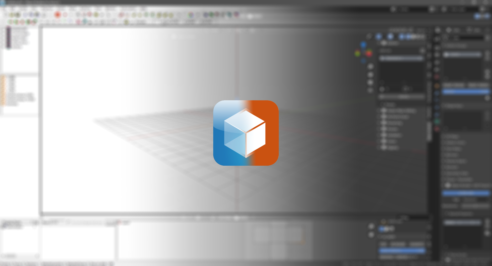

  

<h1 align="center">DayZ Object Builder</h1>

  A free <strong>Blender</strong> add-on for importing, exporting and editing the model, animation and terrain formats used by <strong>DayZ</strong>.

  
  
  

**DayZ Object Builder** (**DZOB**) brings the Bohemia Interactive content pipeline into Blender: open a binarized model straight from the game, edit it, and export it back — without leaving the viewport.

It is a **DayZ**-focused fork of [**Arma 3 Object Builder**](https://github.com/MrClock8163/Arma3ObjectBuilder) by MrClock, adapted and extended specifically for the **DayZ** modding workflow.

## Features

### Import & export

| Format | Notes |
| ------ | ----- |
| **P3D** models | Full round-trip, plus direct **binarized (ODOL)** import — [please read this first](#using-odol-import-responsibly) |
| **XOB** models | Import of the Enfusion binary format — armature, mesh, skin weights, UVs and materials |
| **ANM** animations | Import **and** export of the Enfusion animation format |
| **ASC** terrain | Heightfields |
| **PAA** textures | Import (DXT1 / DXT5) |
| **model.cfg** skeletons | Import & export |
| Object lists | For **Terrain Builder** |

All entries are grouped under a single **DayZ** submenu in `File ▸ Import` / `File ▸ Export`.

### Tools

- **Auto LODs Generator** — one-click Resolution / Geometry / Memory / Fire Geometry / View Geometry LODs, with the expected names, properties and collection layout
- **DayZ character master rig** — a bundled, animation-ready rig added straight from the `Add` menu
- **Live proxy editing** — proxies shown in place as non-selectable preview meshes
- **DayZ Tools integration** — binarized `model.cfg` handled through DayZ Tools' CfgConvert
- DayZ presets: proxies, penetration materials, and the `DayzTemporarySkeleton` rigging skeleton
- Armature reconstruction
- Texture set auto-search across a mod root
- Proxy, mass, hit point, rigging and validation tools
- Assorted utility functions and scripts

## Using ODOL import responsibly

> [!CAUTION]
> **Do not use binarized model import to steal other people's work.**
>
> Opening a binarized model is not a licence to republish it. Ripping vanilla or third-party content out of the game and shipping it — as your own mod, on a workshop page, or anywhere else — is theft, whether it is Bohemia's content or another modder's. Repackaging it, renaming it, or lightly editing it does not make it yours.
>
> Nothing in this add-on can enforce that. Once a model is open in Blender, what happens next is entirely down to the person at the keyboard. I am relying on people to be decent about it.

**This feature exists for reference, not for extraction.** It was added for two concrete jobs:

- **Reading proxy placement.** Seeing how existing models position and orient their proxies, so your own attachment points line up the way the engine actually expects.
- **Fitting clothing to the DayZ character.** Checking a garment against the real body proportions, and against the *other* clothing it has to layer with, so a vest sits correctly over a shirt instead of clipping through it.

Look at the reference, then build your own asset. That is the workflow this was written for, and the one I would ask you to stay inside.

## Changes in this fork

- **Windows long path support.** Paths over the 260 character `MAX_PATH` limit are opened through the extended-length API. Unpacked game asset trees routinely exceed it, especially once the temporary suffix is appended during export.
- **Import and export errors are reported, not raised.** Failures surface as an operator error with the traceback in the system console, instead of an unhandled Blender popup.
- **Texture and RVMAT auto-search.** Point the add-on at a mod root and it resolves the face texture and bound RVMAT for a material from its Base Color image. RVMAT candidates are ranked by whether they actually reference the resolved `.paa`, so sets whose normal map is named differently from the color map still match.
- **Binarized (ODOL) P3D import.** Binarized models open directly through the normal P3D import, with no external debinarizer. Conversion is lossy and one way: the add-on never writes ODOL, and a re-exported model is degraded relative to the original source. It is meant for reference work — see [Using ODOL import responsibly](#using-odol-import-responsibly).
- **Native Enfusion format support.** `.xob` models and `.anm` animations are read directly, and `.anm` can be written back out — so an animation retargeted onto the DayZ rig in Blender can be taken back into the game. Both readers were validated against DayZATool's output.
- **DayZ instead of Arma 3 throughout.** Arma-only RTM/BMTR animation support is gone, the Arma 3 Tools integration is now DayZ Tools, and the bundled presets (proxies, penetration materials, rigging skeleton) point at the DayZ data set.
- **LOD generation built in.** The formerly separate DayZ LOD Tools add-on is merged in as the Auto LODs Generator, so it no longer has to bridge back into this add-on from the outside.

## Requirements & compatibility

- [**Blender** v4.4.0](https://www.blender.org/download/releases/4-4/) or higher
- [**DayZ Tools**](https://store.steampowered.com/app/830640/DayZ_Tools/) — optional, required for some features

The upstream add-on targets **Blender** v2.90.0 and stays compatible with older releases. This fork cannot: the `.anm` animation import and export are built on the slotted action API (`fcurve_ensure_for_datablock`), which only exists from **Blender** v4.4.0 onwards. Development happens on the current release.

## Installation

Download a packaged release, or clone this repository and pack the `DZObjectBuilder/` folder manually. See the official [**Blender** documentation](https://docs.blender.org/manual/en/latest/editors/preferences/addons.html) on installing add-ons.

> [!WARNING]
> **DZOB cannot be enabled alongside Arma 3 Object Builder.** The fork deliberately keeps the upstream `.blend` custom-property names, so both add-ons register the same property identifiers on your objects and would collide. Disable one before enabling the other.

That same decision is what keeps existing `.blend` files working: the model metadata on your objects is stored under the upstream property names, and renaming those would silently drop it. The operator and panel identifiers, by contrast, have been renamed to the DZOB namespace.

## Documentation

Because this fork stays close to upstream in workflow, properties and panel layout, MrClock's documentation on [GitBook](https://mrcmodding.gitbook.io/arma-3-object-builder/home) still describes most of this add-on accurately. Features specific to this fork are documented above; per-version changes are in the [release notes](https://github.com/SXDIST/DayZObjectBuilder/releases).

## Credits

The lineage of this add-on:

- [**ArmAToolbox**](https://github.com/AlwarrenSidh/ArmAToolbox) by Hans-Joerg "Alwarren" Frieden — the original Blender add-on for the Bohemia Interactive engine formats.
- [**Arma 3 Object Builder**](https://github.com/MrClock8163/Arma3ObjectBuilder) by MrClock — a reimplementation of a similar workflow with extended features and an interface closer to Blender's design. This fork's direct parent, and the source of nearly all of its code.
- **DayZ Object Builder** — this fork.

The name goes back to the **Object Builder** application shipped by Bohemia Interactive, whose modelling functionality the Blender add-ons set out to replace.

## License

As inherited from **ArmAToolbox** and **Arma 3 Object Builder**, **DayZ Object Builder** is released under the GNU General Public License version 3.

This program is distributed in the hope that it will be useful, but WITHOUT ANY WARRANTY; without even the implied warranty of MERCHANTABILITY or FITNESS FOR A PARTICULAR PURPOSE. See the GNU General Public License for more details.

You should have received a copy of the GNU General Public License along with this program. If not, see the [GNU licenses](http://www.gnu.org/licenses/).

Files created using this software are not covered by this license.
